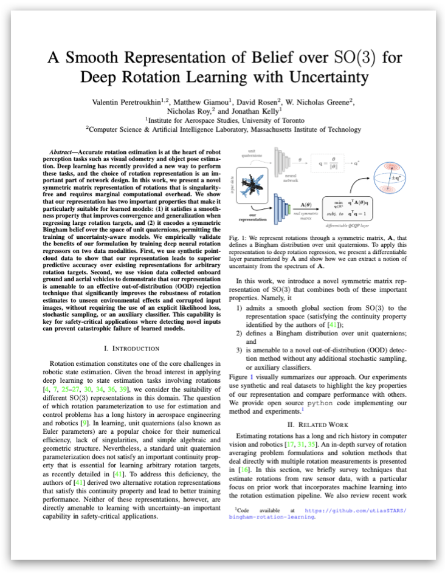

There are many ways to represent rotations: Euler angles, rotation matrices, axis-angle vectors, or unit quaternions, for example. In deep learning, it is common to use unit quaternions for their simple geometric and alebraic structure. However, unit quaternions lack an important <strong>smoothness property</strong> that makes learning 'large' rotations difficult, and other representations are not easily amenable to learning uncertainty. In this work, we address this gap and present a smooth representation that defines a <em>belief</em> (or distribution) over rotations.

---

A Smooth Representation of SO(3) for Deep Rotation Learning with Uncertainty 
Valentin Peretroukhin, Matthew Giamou, David M. Rosen, W. Nicholas Greene, Nicholas Roy, and Jonathan Kelly 
To appear in Robotics: Science and Systems (RSS) 2020 

---
{::nomarkdown} 

    <h2>arXiv Preprint</h2>
    

 

{:/}

### Abstract
Accurate rotation estimation is at the heart of robot perception tasks such as visual odometry and object pose estimation. Deep learning has recently provided a new way to perform these tasks, and the choice of rotation representation is an important part of network design. 

In this work, we present a novel symmetric matrix representation of rotations that is singularity-free and requires marginal computational overhead. We show that our representation has two important properties that make it particularly suitable for learned models: (1) it satisfies a smoothness property that improves convergence and generalization when regressing large rotation targets, and (2) it encodes a symmetric Bingham belief over the space of unit quaternions, permitting the training of uncertainty-aware models. 

We empirically validate the benefits of our formulation by training deep neural rotation regressors  on two data modalities. First, we use synthetic point-cloud data to show that our representation leads to superior predictive accuracy over existing representations for arbitrary rotation targets. Second, we use vision data collected onboard ground and aerial vehicles to demonstrate that our representation is amenable to an effective out-of-distribution (OOD) rejection technique that significantly improves the robustness of rotation estimates to unseen environmental effects and corrupted input images, without requiring the use of an explicit likelihood loss, stochastic sampling, or an auxiliary classifier. This capability is key for safety-critical applications where detecting novel inputs can prevent catastrophic failure of learned models.

# Video
Coming soon...

# Citation

<pre wrap='true'>
@inproceedings{peretroukhin_so3_2020,
   author={Peretroukhin, Valentin and Giamou, Matthew and Rosen, David and Greene, W. Nicholas and Roy, Nicholas and Kelly, Jonathan},
   title={A {S}mooth {R}epresentation of {SO(3)} for {D}eep {R}otation {L}earning with {U}ncertainty},
   booktitle={Proceedings of Robotics: Science and Systems},
   year={2020},
   doi={TBD},
   url={TBD}
}
</pre>
